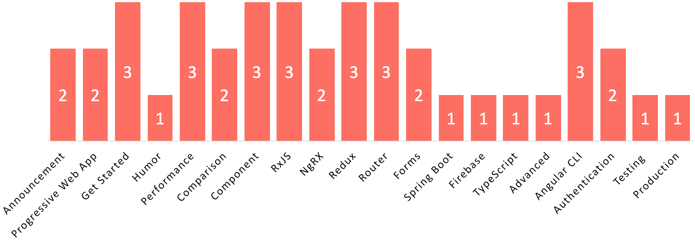

# learn-angular
Top 40 Angular Articles of 2017

</a>

For Jan-Dec 2017, we compared nearly 9,000 articles about Angular and picked the Top 40 (0.44%).

This is an extremely competitive list. Mybridge AI ranks articles based on the quality of content measured by our machine and a variety of human factors including the number of shares and minutes read.

This directory is designed to make your life easier as it organizes the most useful articles by 20 key topics, where experienced web developers share their lessons working with Angular

</a>

If you like a version with images: https://medium.com/@Mybridge/learn-angular-from-top-articles-for-the-past-year-v-2018-45d69437c016

1. [Announcement](#announcement)
1. [Progressive Web App](#progressive-web-app)
1. [Get Started](#get-started)
1. [Humor](#humor)
1. [Performance](#performance)
1. [Comparison](#comparison)
1. [Component](#component)
1. [RxJS](#rxJS)
1. [NgRX](#ngRX)
1. [Redux](#redux)
1. [Router](#router)
1. [Forms](#forms)
1. [Spring Boot](#spring-boot)
1. [Firebase](#firebase)
1. [TypeScript](#typeScript)
1. [Advanced](#advanced)
1. [Angular CLI](#angular-CLI)
1. [Authentication](#authentication)
1. [Testing ](#testing)
1. [Production](#production)

 

### Recommended Learning

A) Beginner: [Learn to build an Angular App with Angular Material, Angularfire & NgRx Use Angular, Angular Material, AngularFire.](http://bit.ly/2EuWavj) [3,037 recommends, 4.9/5 stars]

B) Security: [Angular 5 Security Masterclass: Add Authentication / Authorization (from scratch) to an Angular 5 / Node App](http://bit.ly/2sfzvhD) [877 recommends, 4.7/5 stars]

 

### Announcement
* [Version 5.0.0 of Angular Now Available](https://blog.angular.io/version-5-0-0-of-angular-now-available-37e414935ced?utm_source=mybridge&utm_medium=email&utm_campaign=read_more)
* [Angular 5.1 & More Now Available](https://blog.angular.io/angular-5-1-more-now-available-27d372f5eb4e?utm_source=mybridge&utm_medium=email&utm_campaign=read_more)

 

### Progressive Web App
* [Progressive Web Apps with Angular 2+](https://houssein.me/progressive-angular-applications?utm_source=mybridge&utm_medium=email&utm_campaign=read_more)
* [A new Angular Service Worker — creating automatic progressive web apps. Part 2: practice](https://medium.com/@webmaxru/a-new-angular-service-worker-creating-automatic-progressive-web-apps-part-2-practice-3221471269a1?utm_source=mybridge&utm_medium=email&utm_campaign=read_more)

 

### Get Started
* [How to not to suffer with Angular - The In-Depth Tutorial](https://malcoded.com/posts/angular-beginners-guide?utm_source=mybridge&utm_medium=email&utm_campaign=read_more)
* [10 Ways to Misuse Angular](http://blog.rangle.io/10-ways-to-misuse-angular?utm_source=mybridge&utm_medium=email&utm_campaign=read_more)
* [Angular 5 Release: What’s New?](https://auth0.com/blog/whats-new-in-angular5?utm_source=mybridge&utm_medium=email&utm_campaign=read_more)

 

### Humor
* [Angular... It’s You, Not Me. A breakup letter. [Humor] Read comments for laugh!](https://levelup.gitconnected.com/angular-its-you-not-me-9e9232ad3bcd?utm_source=mybridge&utm_medium=email&utm_campaign=read_more)

 

### Performance
* [Angular 2 Performance Checklist](https://github.com/mgechev/angular-performance-checklist?utm_source=mybridge&utm_medium=email&utm_campaign=read_more)
* [Making your Angular apps fast](http://blog.thoughtram.io/angular/2017/02/02/making-your-angular-app-fast.html?utm_source=mybridge&utm_medium=email&utm_campaign=read_more)
* [Using Zones in Angular for better performance](http://blog.thoughtram.io/angular/2017/02/21/using-zones-in-angular-for-better-performance.html?utm_source=mybridge&utm_medium=email&utm_campaign=read_more)

 

### Comparison
* [Angular vs. React vs. Vue: A 2017 comparison](https://medium.com/unicorn-supplies/angular-vs-react-vs-vue-a-2017-comparison-c5c52d620176?utm_source=mybridge&utm_medium=email&utm_campaign=read_more)
* [A Look at Angular Alongside Vue - Familiar Code](https://johnpapa.net/a-look-at-angular-alongside-vue-3?utm_source=mybridge&utm_medium=email&utm_campaign=read_more)

 

### Component
* [Create a dynamic tab component with Angular](https://juristr.com/blog/2017/07/ng2-dynamic-tab-component?utm_source=mybridge&utm_medium=email&utm_campaign=read_more)
* [3 Ways to Pass Async Data to Angular 2+ Child Components](https://scotch.io/tutorials/3-ways-to-pass-async-data-to-angular-2-child-components?utm_source=mybridge&utm_medium=email&utm_campaign=read_more)
* [Angular :host, :host-context, ::ng-deep - The Complete Guide](https://blog.angular-university.io/angular-host-context?utm_source=mybridge&utm_medium=email&utm_campaign=read_more)

 

### RxJS
* [Top 7 RxJS Concepts for Angular Developers](https://www.youtube.com/watch?v=65Us8NwmYf4?utm_source=mybridge&utm_medium=email&utm_campaign=read_more)
* [Learn to combine RxJs sequences with super intuitive interactive diagrams](https://blog.angularindepth.com/learn-to-combine-rxjs-sequences-with-super-intuitive-interactive-diagrams-20fce8e6511?utm_source=mybridge&utm_medium=email&utm_campaign=read_more)
* [RxJS: Observables, observers and operators introduction](https://toddmotto.com/rxjs-observables-observers-operators?utm_source=mybridge&utm_medium=email&utm_campaign=read_more)

 

### NgRX
* [NgRx: Patterns and Techniques](https://blog.nrwl.io/ngrx-patterns-and-techniques-f46126e2b1e5?utm_source=mybridge&utm_medium=email&utm_campaign=read_more)
* [Using NgRx 4 to Manage State in Angular Applications](https://blog.nrwl.io/using-ngrx-4-to-manage-state-in-angular-applications-64e7a1f84b7b?utm_source=mybridge&utm_medium=email&utm_campaign=read_more)

 

### Redux
* [Finally understand Redux by building your own Store](https://toddmotto.com/redux-typescript-store?utm_source=mybridge&utm_medium=email&utm_campaign=read_more)
* [Redux in Angular 2: Learn what Redux is, when to use and why, and how to implement it in an Angular 2 app](https://www.youtube.com/watch?v=UEcdQR-NoNA?utm_source=mybridge&utm_medium=email&utm_campaign=read_more)
* [Learn Redux in Angular with NgRx Store](https://malcoded.com/posts/angular-ngrx-guide?utm_source=mybridge&utm_medium=email&utm_campaign=read_more)

 

### Router
* [Getting started with Angular's Router](https://toddmotto.com/angular-component-router?utm_source=mybridge&utm_medium=email&utm_campaign=read_more)
* [Managing State in Angular Applications](https://blog.nrwl.io/managing-state-in-angular-applications-22b75ef5625f?utm_source=mybridge&utm_medium=email&utm_campaign=read_more)
* [The 7-step process of Angular router navigation](https://www.jvandemo.com/the-7-step-process-of-angular-router-navigation?utm_source=mybridge&utm_medium=email&utm_campaign=read_more)

 

### Forms
* [Working with Angular 4 Forms: Nesting and Input Validation](https://www.toptal.com/angular-js/angular-4-forms-validation?utm_source=mybridge&utm_medium=email&utm_campaign=read_more)
* [Demystifying dynamic Forms in Angular](https://juristr.com/blog/2017/10/demystify-dynamic-angular-forms?utm_source=mybridge&utm_medium=email&utm_campaign=read_more)

 

### Spring Boot
* [Build a Basic CRUD App with Angular 5.0 and Spring Boot 2.0 | Okta Developer](https://developer.okta.com/blog/2017/12/04/basic-crud-angular-and-spring-boot?utm_source=mybridge&utm_medium=email&utm_campaign=read_more)

 

### Firebase
* [Building An Angular 5 Project with Bootstrap 4 and Firebase](https://medium.com/codingthesmartway-com-blog/building-an-angular-5-project-with-bootstrap-4-and-firebase-4504ff7717c1?utm_source=mybridge&utm_medium=email&utm_campaign=read_more)

 

### TypeScript
* [5 Key Benefits of Angular and TypeScript 10 - Dan Wahlin](https://blog.codewithdan.com/2017/08/26/5-key-benefits-of-angular-and-typescript?utm_source=mybridge&utm_medium=email&utm_campaign=read_more)

 

### Advanced
* [Advanced Angular Concepts by Alex Rickabaugh](https://www.youtube.com/watch?v=rKbY1t39dHU?utm_source=mybridge&utm_medium=email&utm_campaign=read_more)

 

### Angular CLI
* [6 Best Practices & Pro Tips when using Angular CLI](https://medium.com/@tomastrajan/6-best-practices-pro-tips-for-angular-cli-better-developer-experience-7b328bc9db81?utm_source=mybridge&utm_medium=email&utm_campaign=read_more)
* [Using Sass with the Angular CLI](https://scotch.io/tutorials/using-sass-with-the-angular-cli?utm_source=mybridge&utm_medium=email&utm_campaign=read_more)
* [Building an Angular 4 Component Library with the Angular CLI and ng-packagr](https://medium.com/@nikolasleblanc/building-an-angular-4-component-library-with-the-angular-cli-and-ng-packagr-53b2ade0701e?utm_source=mybridge&utm_medium=email&utm_campaign=read_more)

 

### Authentication
* [Authentication With JWT: The Complete Guide](https://blog.angular-university.io/angular-jwt-authentication?utm_source=mybridge&utm_medium=email&utm_campaign=read_more)
* [Angular Authentication: Using the Http Client and Http Interceptors](https://medium.com/@ryanchenkie_40935/angular-authentication-using-the-http-client-and-http-interceptors-2f9d1540eb8?utm_source=mybridge&utm_medium=email&utm_campaign=read_more)

 

### Testing 
* [Angular Testing In Depth: Components](https://auth0.com/blog/angular-testing-in-depth-components?utm_source=mybridge&utm_medium=email&utm_campaign=read_more)

 

### Production
* [Angular in Production](http://blog.mgechev.com/2017/01/17/angular-in-production?utm_source=mybridge&utm_medium=email&utm_campaign=read_more)
